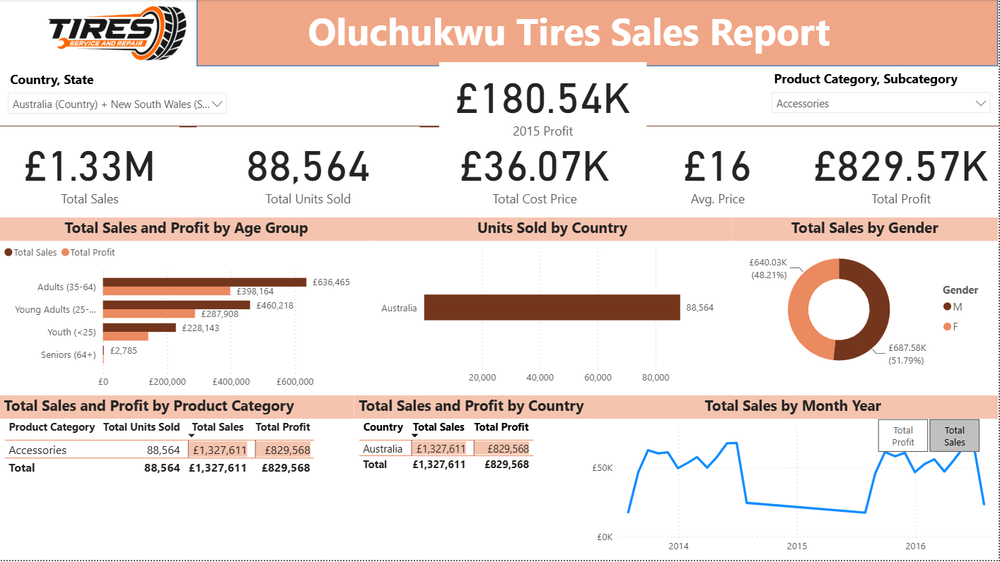

# Retail Sales Dashboard

A one-page Power BI sales report covering sales, profit and units sold across countries, customer age groups, gender and product categories, with a product-level tooltip for drill-down detail.

---

## What the Dashboard Shows
- **Headline KPIs:** total sales, total profit, units sold, average price
- **Sales by customer age group** and **by country**
- **Customer gender split**
- **Sales and profit by country and by product category** (tables)
- **Trend over time**, with a switch to change which metric the line shows
- **Filters:** country/state and product category slicers
- **Product tooltip:** hovering over a visual shows sales broken down by product

## Power BI Features Used
- Dedicated measures table, kept separate from the data
- Separate date table
- Field parameters, to switch the metric on the trend line
- Custom tooltip page
- Conditional formatting
- Slicers for interactive filtering

## Data
Public retail sales practice dataset.

## Tools
Power BI Desktop (Power Query, DAX, field parameters, tooltip pages)

## How to Open
1. Download or clone this repository
2. Open `PowerBI/RetailSalesDashboard.pbix` in Power BI Desktop (Windows)

---
**Author:** Oluchukwu Ejiofor · [Email](mailto:Oluchukwu.b.ejiofor@gmail.com)
